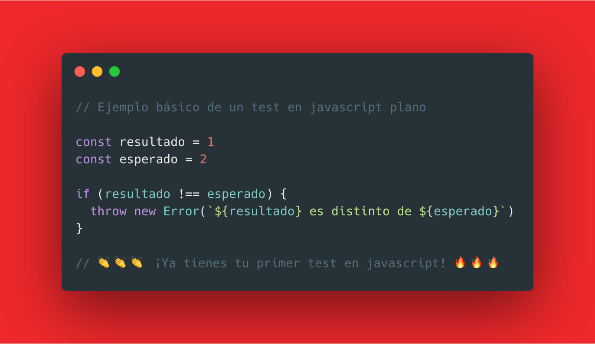
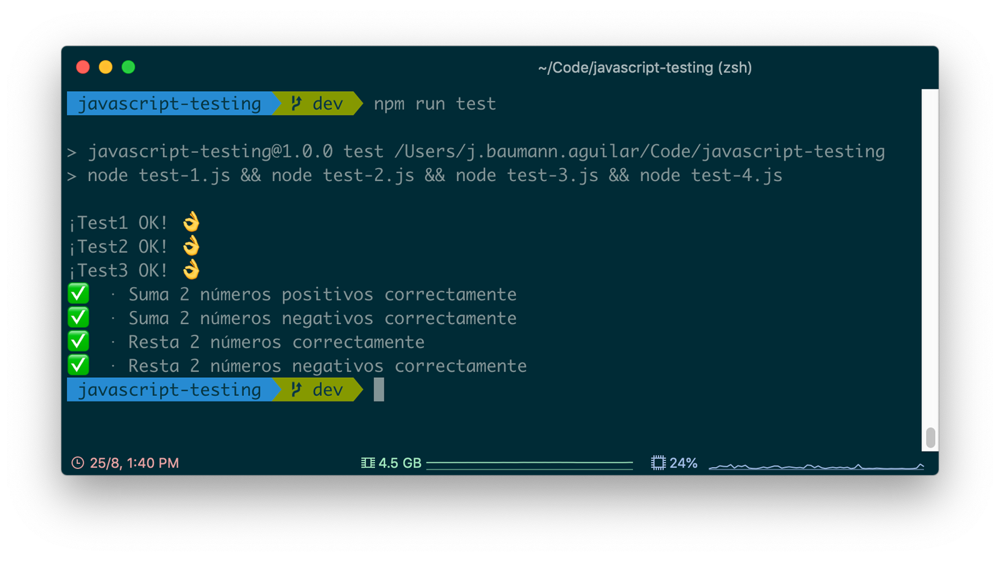
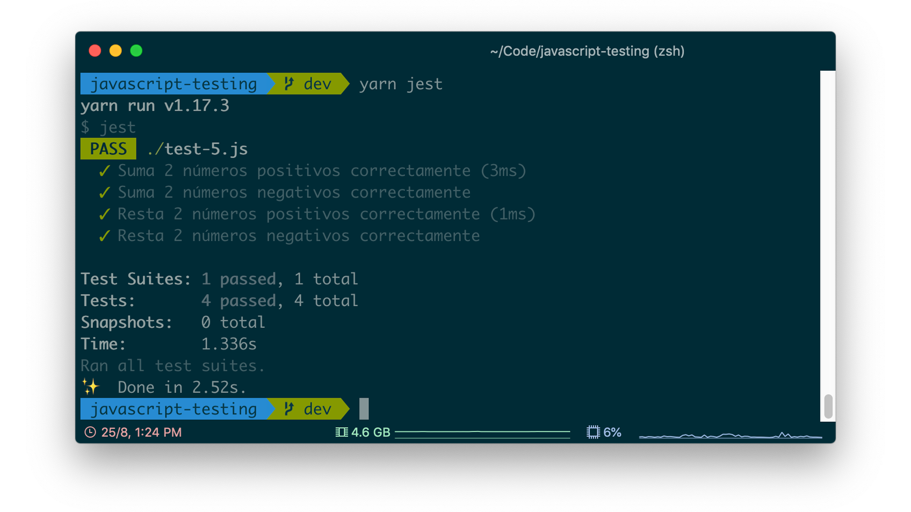

## Introducción Testing



## Prerequisitos

#git
#nodejs
#npm

## Ejecución de Tests
Desde la consola de comandos, hacemos lo siguiente:
 
```
node test-0.js
```
```
node test-1.js 
```
```
node test-2.js
```
```
node test-3.js
```
```
node test-4.js
```

###### Todos los test anteriores
```
npm run test
```




###### Test con Jest
```
npm run jest
```



# TDD_BASIC
